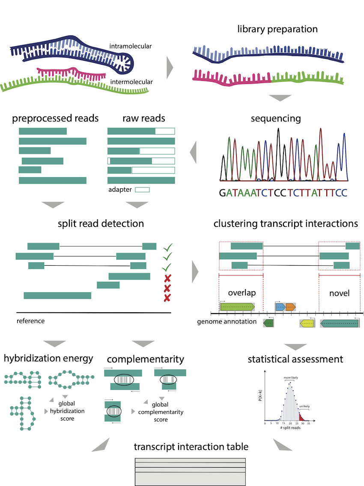

# RNAnue - 1.0.0

[](https://github.com/Ibvt/RNAnue/actions/workflows/docker.yml)

## About

RNAnue is a comprehensive tool for detecting RNA-RNA interactions from Direct-Duplex-Detection (DDD) data.

## Installation

We recommend using the provided installer to set up RNAnue.  
If your operating system is not supported, you can use RNAnue via Docker or build it from source.

### Installer

Download OS-specific installers for macOS and Debian here: [Latest Release](https://github.com/ChristopherAdelmann/RNAnue/releases/latest).

### Docker

We provide a ready-to-use [Docker container](https://hub.docker.com/repository/docker/cobirna/rnanue) with RNAnue pre-configured.

```bash
docker pull cobirna/rnanue:latest
docker run -ti  cobirna/rnanue
```

### Singularity

The Docker container can also be used with Singularity.

```bash
singularity pull docker://cobirna/rnanue:latest
singularity exec --bind /path/to/data:/data rnanue_latest.sif RNAnue <subcall> --config /data/params.cfg
```

### Building from source

#### Prerequisites

To build RNAnue, you need `cmake (>=v2.24.0)`.  
If you need to compile ViennaRNA, you also need `autoconf`, `automake`, and `libtool` (see [Dependencies](#dependencies)).

#### Downloading

Clone the repository and its submodules:

```bash
git clone --recurse-submodules <git-repo-here>
```

#### Building and Installing

Build and install RNAnue with the following commands:

```bash
mkdir build
cd build
cmake ..
cmake --build . --parallel <num-threds-here>
cmake --install .
```

> **IMPORTANT**  
> RNAnue can only be compiled with [gcc](https://gcc.gnu.org) (tested with v13.2.0)  

> **IMPORTANT – MacOS**  
> When building on macOS, you need to specify the GCC compiler to avoid using AppleClang:  
> ```cmake -DCMAKE_CXX_COMPILER=<path-to-g++> -DCMAKE_CC_COMPILER=<path-to-gcc> ..```

#### Dependencies

RNAnue includes the following dependencies:

* [Boost](https://github.com/boostorg/boost) (v1.85.0)
* [Segemehl](http://www.bioinf.uni-leipzig.de/Software/segemehl/) (v0.3.4)
* [SeqAn](https://github.com/seqan/seqan3) (v3.3.0)

The following dependencies will be used if present on the system, otherwise they will be fetched (internet connection required):

* [htslib](https://github.com/samtools/htslib.git) (v1.20)
* [Vienna Package](https://www.tbi.univie.ac.at/RNA/#binary_packages) (v2.6.4)

## Overview



## Usage

### Positional Arguments

RNAnue provides different sub-calls for individual pipeline steps. These include `preprocess`,
`align`, `detect`, `analyze`. In addition, `complete` applies the whole workflow.

## Input

> **IMPORTANT** RNAnue requires the sequencing files to be in a specific folder structure.  

The root folders of the treatments (`--trtms`; required) and controls (`--ctrls`; optional) are specified accordingly. These folders contain sub-folders
with arbitrary conditions (e.g., treatment, cell lines,...) that in turn contain the read files.

### Single-End folder structure

```text
./trtms/
    condition1
        *.fastq
    condition2
        *.fastq
./ctrls/
    condition1
        *.fastq
    condition2
        *.fastq
```

### Paired-End folder structure

> **IMPORTANT**  In order to process paired-end files `--readtype = PE` must be set and files must end with "forward.fastq" and "reverse.fastq".

```text
./trtms/
    condition1
        *forward.fastq
        *reverse.fastq
    condition2
        *forward.fastq
        *reverse.fastq
./ctrls/
    condition1
        *forward.fastq
        *reverse.fastq
    condition2
        *forward.fastq
        *reverse.fastq
```

## Parameters

RNAnue accepts parameter settings both from the command-line and through a configuration file.
For the latter, we provide a template configuration file ([params.cfg](./example/params.cfg)) that
allows to set the parameters in a more convenient fashion. This means that the call of RNAnue
is reduced to the following call.

```bash
RNAnue <sub-call-here> --config /path/to/params.cfg
```

In any case, the specifying parameters over the command lines has precedence over the config file.

## Results

In principle, the results of the analysis are stored in the specified output folder and its sub-folders
(e.g., ./preprocess, ./align, ./detect, ./analyze). RNAnue reports the split reads in SAM format, the clusters
and the RNA-RNA interactions. RNAnue reports the split reads in SAM format. Additionally, the complementarity
scores and hybridization energies are stored in the tags FC and FE, respectively. We report the clusters in a
custom format that includes the IDs of the clusters, its length, size and genomic coordinates.

### Split Reads (.SAM)

RNAnue reports the detected splits in .SAM format (RNAnue `detect`). In this file, pairs of rows represent the
split reads, consisting of the individual segments, e.g

```text
A00551:29:H73LYDSXX:1:1101:7274:10645 16 gi|170079663|ref|NC_010473.1| 3520484 22 1X51= * 0 0 AGGGGTCTTTCCGTCTTGCCGCGGGTACACTGCATCTTCACAGCGAGTTCAA * XA:Z:TTTCTGG XC:f:0.714286 XE:f:-15.6 XL:i:7 XM:i:5 XN:i:0 XR:f:0.0735294 XS:i:5 XX:i:1 XY:i:52
A00551:29:H73LYDSXX:1:1101:7274:10645 16 gi|170079663|ref|NC_010473.1| 3520662 22 11=5S * 0 0 TTCGATCAAGAAGAAC * XA:Z:GAAGAAC XC:f:0.714286 XE:f:-15.6 XL:i:7 XM:i:5 XN:i:0 XR:f:0.0735294 XS:i:5 XX:i:53 XY:i:68

```

In the following the tags are listed that are reported in the detected split reads. Please note that in the upper
segment the alignment is in reverse as done in the calculation of the complementarity to represent the 3'-5' and 5'-3'
duplex.

| tag | description |
| --- | ----------- |
| XC:f | complementarity |
| XL:f | length of alignment |
| XR:f | site length ratio |
| XM:i | matches in alignment |
| XA:Z | alignment of sequence |
| XE:f | hybridization energy |

### Clustering results

### Interaction table

### Testing

## Troubleshooting

contact <cobi@ibvt.uni-stuttgart.de> or create an issue
